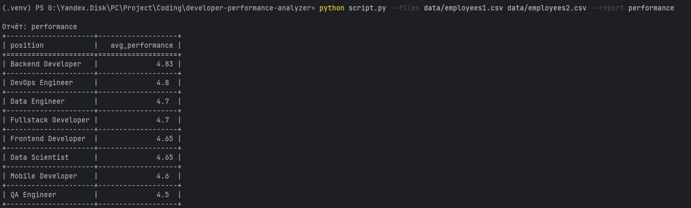

# Developer Performance Analyzer

## 📋 Описание

Скрипт анализирует данные разработчиков из CSV файлов и формирует отчёт по средней эффективности по должностям. Проект реализован с учётом требований тестового задания для Python Junior разработчика.

## ✨ Функциональность

- Чтение одного или нескольких CSV файлов с данными разработчиков
- Формирование отчёта "performance" с расчётом средней эффективности по должностям
- Сортировка результатов по убыванию эффективности
- Вывод отчёта в консоль в виде форматированной таблицы
- Валидация входных данных и аргументов командной строки
- Полное покрытие тестами (>80%)
- Расширяемая архитектура для добавления новых типов отчётов


## 🛠 Технологический стек

- **Python 3.8+**
- **Зависимости:** `tabulate`
- **Тестирование:** `pytest`, `pytest-cov`

## 📦 Установка

```bash
# Клонирование репозитория
git clone https://github.com/Dezexus/developer-performance-analyzer.git

# Установка зависимостей
pip install -r requirements.txt
```

## 🚀 Использование

### Базовый запуск

```bash
python script.py --files data/sample1.csv --report performance
```

### С несколькими файлами

```bash
python script.py --files data/sample1.csv data/sample2.csv --report performance
```

### Пример работы скрипта



### Получение справки

```bash
python script.py --help
```

## 🧪 Тестирование

### Запуск всех тестов

```bash
python -m pytest tests/ -v
```

## 📊 Добавление нового отчёта

Архитектура проекта позволяет легко добавлять новые типы отчётов:

1. Создайте новый класс отчёта, унаследованный от `BaseReport`:

```python
# src/reports/new_report.py
from .base_report import BaseReport

class NewReport(BaseReport):
    def __init__(self):
        self.name = "new_report"
    
    def generate(self, data):
        # Ваша логика генерации отчёта
        results = []
        # ... обработка данных ...
        return results
    
    def get_name(self):
        return self.name
```

2. Зарегистрируйте отчёт в фабрике:

```python
# В src/reports/__init__.py добавить:
from .new_report import NewReport

class ReportFactory:
    _reports = {
        'performance': PerformanceReport,
        'new_report': NewReport,  # Добавлено
    }
    # ... остальной код ...
```
